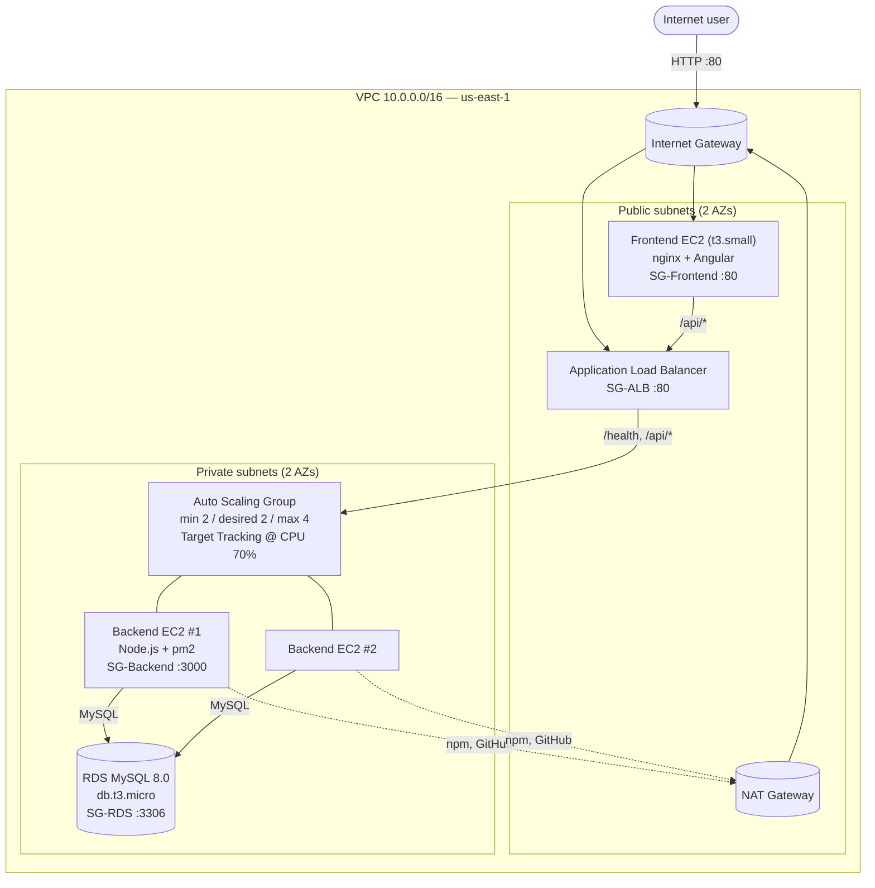

# Projet Cloud — AWS Infrastructure as Code

Terraform project that provisions a production-style 3-tier web stack on AWS for a full-stack Node.js + Angular + MySQL application.

> **Application code** lives in two separate public repos that EC2 user_data clones at boot:
> - Backend (Node.js + Express): https://github.com/xmpp-zox/backend
> - Frontend (Angular 19): https://github.com/xmpp-zox/client

---

## TL;DR — Run it locally in 3 steps

> Tested on Windows (PowerShell 5+) and Linux/macOS (bash). The whole stack comes up in ~10 minutes.

**1. Install the two CLIs and configure AWS credentials**

| Tool       | Install                                                          | Verify                  |
|------------|------------------------------------------------------------------|-------------------------|
| Terraform  | https://developer.hashicorp.com/terraform/install                | `terraform -version`    |
| AWS CLI v2 | https://docs.aws.amazon.com/cli/latest/userguide/getting-started-install.html | `aws --version`         |

Then either run `aws configure` *or* paste your AWS Academy session credentials into `~/.aws/credentials`.

**2. Clone and deploy**

```powershell
# Windows / PowerShell
git clone https://github.com/xmpp-zox/projet-cloud-infra.git
cd projet-cloud-infra
./deploy.ps1
```

```bash
# Linux / macOS
git clone https://github.com/xmpp-zox/projet-cloud-infra.git
cd projet-cloud-infra
chmod +x deploy.sh && ./deploy.sh
```

The script prompts for the RDS password, runs `terraform init` + `apply`, and prints the URLs.

**3. Open the app**

```
terraform output frontend_url     # http://<public-ip>
```

Wait ~3–4 min after apply finishes for the Angular build to complete on the frontend EC2, then open the URL — you should see the user list rendered by Angular calling the ALB.

**Tear down when done** (important — saves AWS Academy budget):

```powershell
./destroy.ps1     # or ./destroy.sh
```

---

## Architecture



> The browser hits the **frontend EC2** for HTML/JS, then the SPA calls the **ALB** for `/api/*`. The ALB only forwards to backends in private subnets, which are the only ones allowed to talk to the **RDS**. NAT GW lets backends reach `npm` and `github.com` for bootstrap.

- **VPC** `10.0.0.0/16`, 2 AZs (`us-east-1a`/`b`)
- **Subnets** 2 public (`10.0.1.0/24`, `10.0.2.0/24`) + 2 private (`10.0.11.0/24`, `10.0.12.0/24`)
- **IGW** for public subnets, **NAT GW** for private subnets to reach the internet (npm, GitHub)
- **4 Security Groups** with least-privilege ingress (see "Security" below)
- **ALB + Target Group + ASG** in front of the backend, health check on `GET /health`
- **Frontend EC2** `t3.small` + 16 GB gp3 — large enough to run `ng build` without OOM
- **RDS MySQL 8.0** `db.t3.micro`, password injected via env var (never in code)

## Prerequisites

- Terraform ≥ 1.5 and AWS provider 5.x
- AWS credentials in `~/.aws/credentials` with permissions for EC2 / VPC / RDS / ELB / AutoScaling
- (AWS Academy Sandbox: refresh your `aws_access_key_id`, `aws_secret_access_key`, `aws_session_token` from "AWS Details → AWS CLI" each session)
- An EC2 keypair imported in the region if you want SSH access (optional)

## Quick start

```powershell
cd terraform
Copy-Item terraform.tfvars.example terraform.tfvars
# edit terraform.tfvars (region, repos, key_name, ssh_cidr)

$env:TF_VAR_db_password = "ChangeMe-Strong-Pass-123!"

terraform init
terraform plan
terraform apply       # ~8–10 min for full stack
```

After apply finishes:

```powershell
terraform output
# alb_dns_name = "proj-cloud-alb-xxxxxxx.us-east-1.elb.amazonaws.com"
# frontend_url = "http://<public-ip>"
# rds_endpoint = "proj-cloud-db.xxx.us-east-1.rds.amazonaws.com"

curl "http://$(terraform output -raw alb_dns_name)/health"     # -> 200 OK
Start-Process (terraform output -raw frontend_url)             # opens Angular UI
```

The frontend EC2 spends ~3–4 minutes after boot installing Node.js, cloning the Angular repo, running `ng build`, and copying `dist/client/browser/*` to nginx.

## Resilience demo

```powershell
aws ec2 describe-instances `
  --filters "Name=tag:Name,Values=proj-cloud-backend" "Name=instance-state-name,Values=running" `
  --query "Reservations[].Instances[].InstanceId" --output text

aws ec2 terminate-instances --instance-ids <i-xxxx>
```

The ASG immediately launches a replacement; the ALB keeps serving requests through the surviving instance — zero downtime.

## Security

| SG            | Ingress                                                |
|---------------|--------------------------------------------------------|
| `sg-alb`      | `0.0.0.0/0` :80                                        |
| `sg-backend`  | `sg-alb` :3000 only                                    |
| `sg-frontend` | `0.0.0.0/0` :80, `ssh_cidr` :22 (only if key_name set) |
| `sg-rds`      | `sg-backend` :3306 only — **no public access**         |

Secrets:
- `db_password` is `sensitive = true` and read from `TF_VAR_db_password`.
- `terraform.tfstate` is git-ignored (it would otherwise leak the DB password).
- `*.tfvars` is git-ignored; only `terraform.tfvars.example` is committed.

## Tear down

```powershell
terraform destroy
```

Always destroy at the end of a session (especially in AWS Academy) to free the budget.

## Using `make` (Linux/macOS)

```bash
make help        # list all targets
make deploy      # init + apply + show outputs
make destroy     # tear everything down
make plan        # preview changes
make fmt         # format .tf files
```

## Screenshots

See [docs/](docs/) for screenshot captures. Recommended:

| # | What | Where |
|---|------|-------|
| 1 | VPC resource map | VPC → Your VPCs → Resource map |
| 2 | 2 public + 2 private subnets across 2 AZs | VPC → Subnets |
| 3 | The 4 Security Groups with their rules | EC2 → Security Groups |
| 4 | Healthy targets (2/2) | EC2 → Target Groups → Health |
| 5 | ASG configured min 2 / desired 2 / max 4 | EC2 → Auto Scaling Groups |
| 6 | RDS Available + Public access No | RDS → Databases |
| 7 | Working Angular UI | Browser at `frontend_url` |
| 8 | XHR call going to ALB DNS | DevTools → Network tab |

## File map

| File | Purpose |
|------|---------|
| `versions.tf` | Provider + Terraform version pinning |
| `variables.tf` | All inputs |
| `network.tf` | VPC, subnets, IGW, NAT, route tables |
| `security_groups.tf` | The four SGs |
| `ami.tf` | Latest Amazon Linux 2023 lookup |
| `rds.tf` | DB subnet group + MySQL instance |
| `backend.tf` | ALB, target group, listener, launch template, ASG, scaling policy |
| `frontend.tf` | Public EC2 serving Angular |
| `user_data/backend.sh.tftpl` | Bootstraps Node.js + pm2 + clones backend |
| `user_data/frontend.sh.tftpl` | Grows root FS, swap, installs nginx, builds Angular |
| `outputs.tf` | URLs and IDs |
| `deploy.ps1` / `deploy.sh` | One-command deploy helper |
| `destroy.ps1` / `destroy.sh` | One-command tear-down helper |

## Design notes

- **Why a separate frontend EC2 (not S3+CloudFront)?** The brief required EC2-based hosting and a public/private split with the ALB in between — that hits the security/networking grading criteria.
- **Why build Angular on the EC2 (not in CI)?** Keeps the demo single-command (`terraform apply`); the t3.small + 2 GB swap + 16 GB gp3 root handle `ng build` cleanly.
- **Why `user_data_replace_on_change = true`?** Edits to the bootstrap script force EC2 replacement, so the new user_data actually runs (an in-place modify would silently skip it).
- **Auto-grow root FS:** `frontend.sh.tftpl` runs `growpart` + `xfs_growfs` first, so even if AWS provisions only the AMI's 2 GB snapshot the partition is expanded to the full 16 GB before npm installs anything.

## License

MIT
