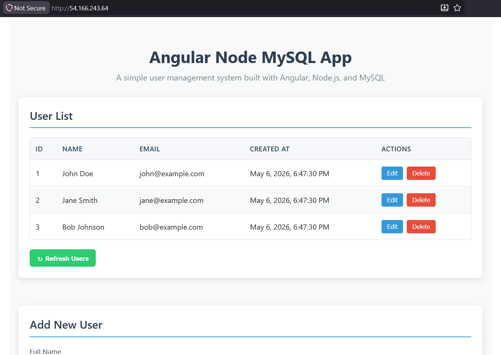
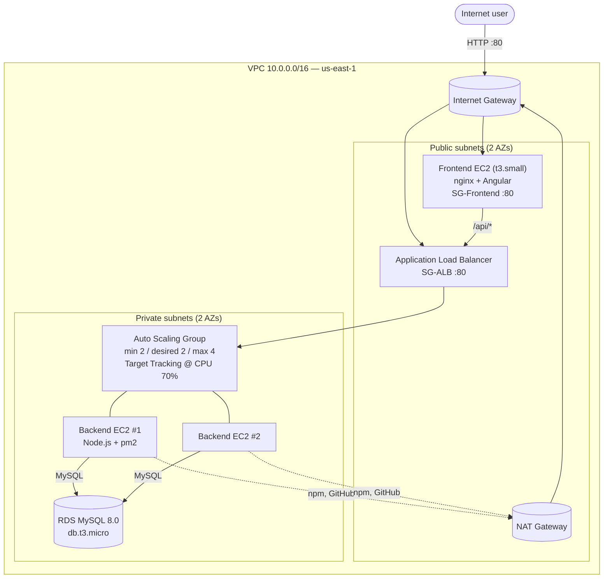

# Projet Cloud — AWS Infrastructure as Code

Terraform that provisions a production-style 3-tier web stack on AWS for a Node.js + Angular + MySQL app.

| Component | Repo |
|-----------|------|
| Backend (Node.js + Express) | https://github.com/xmpp-zox/backend |
| Frontend (Angular 19) | https://github.com/xmpp-zox/client |
| Infrastructure (this repo) | https://github.com/xmpp-zox/projet-cloud-infra |

The backend and frontend repos are cloned by EC2 user_data at boot — no manual build needed.



> See [`docs/`](docs/) for the full deployment screenshot gallery (VPC, SGs, ALB targets, ASG, RDS, DevTools).

---

## Architecture



Browser → frontend EC2 (HTML/JS) → ALB (`/api/*`) → ASG backends → RDS. Backends are unreachable from the internet; only the ALB SG can reach them. RDS only accepts traffic from the backend SG.

---

## Prerequisites

| Tool | Install | Verify |
|------|---------|--------|
| Terraform ≥ 1.5 | https://developer.hashicorp.com/terraform/install | `terraform -version` |
| AWS CLI v2      | https://docs.aws.amazon.com/cli/latest/userguide/getting-started-install.html | `aws --version` |

Configure credentials with `aws configure`, or paste your AWS Academy session credentials into `~/.aws/credentials` (refresh each session).

---

## Deploy

```powershell
git clone https://github.com/xmpp-zox/projet-cloud-infra.git
cd projet-cloud-infra
./deploy.ps1            # Linux/macOS:  ./deploy.sh   or   make deploy
```

The script prompts for the RDS password, runs `terraform init` + `apply`, and prints the URLs (~10 min).

After it finishes, wait ~3–4 min for the Angular build on the frontend EC2, then:

```powershell
terraform output frontend_url     # http://<public-ip>
```

Open that URL — the Angular UI loads and lists users from the ALB.

---

## Destroy

```powershell
./destroy.ps1           # Linux/macOS:  ./destroy.sh   or   make destroy
```

Always destroy when done (especially in AWS Academy) to free the budget.

---

## Resilience demo

```powershell
aws ec2 describe-instances `
  --filters "Name=tag:Name,Values=proj-cloud-backend" "Name=instance-state-name,Values=running" `
  --query "Reservations[].Instances[].InstanceId" --output text

aws ec2 terminate-instances --instance-ids <i-xxxx>
```

The ASG launches a replacement; the ALB keeps serving through the surviving instance — zero downtime.

---

## Security

| SG            | Ingress |
|---------------|---------|
| `sg-alb`      | `0.0.0.0/0` :80 |
| `sg-frontend` | `0.0.0.0/0` :80, `ssh_cidr` :22 (only if `key_name` is set) |
| `sg-backend`  | `sg-alb` :3000 only |
| `sg-rds`      | `sg-backend` :3306 only — **no public access** |

- `db_password` is `sensitive = true`, read from `TF_VAR_db_password`.
- `terraform.tfstate` and `*.tfvars` are git-ignored (only `terraform.tfvars.example` is committed).
- No secret is ever embedded in source code.

---

## File map

```
terraform/
├─ versions.tf            Provider + Terraform version pinning
├─ variables.tf           All inputs
├─ network.tf             VPC, subnets, IGW, NAT, route tables
├─ security_groups.tf     The 4 SGs
├─ ami.tf                 Latest Amazon Linux 2023 lookup
├─ rds.tf                 DB subnet group + MySQL instance
├─ backend.tf             ALB, target group, listener, launch template, ASG, scaling policy
├─ frontend.tf            Public EC2 serving Angular
├─ outputs.tf             URLs and IDs
├─ user_data/
│  ├─ backend.sh.tftpl    Bootstraps Node.js + pm2 + clones backend
│  └─ frontend.sh.tftpl   Grows root FS, swap, installs nginx, builds Angular
├─ deploy.ps1 / .sh       One-command deploy
├─ destroy.ps1 / .sh      One-command tear-down
├─ Makefile               make deploy / destroy / plan / fmt / validate
└─ docs/                  Screenshots
```

---

## License

MIT
