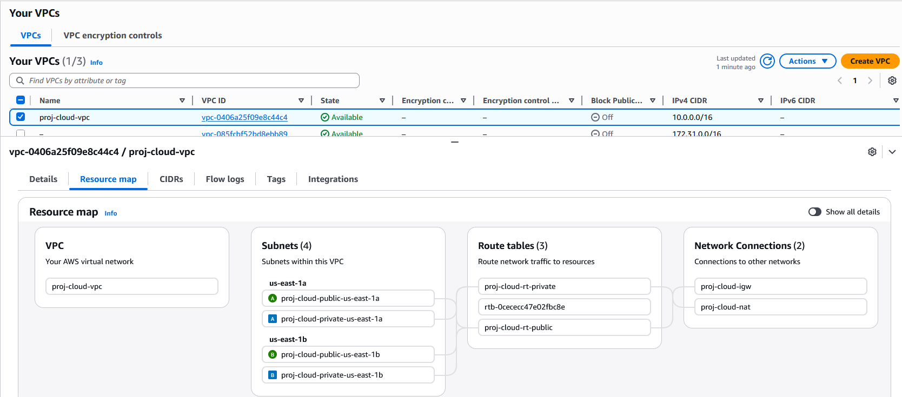
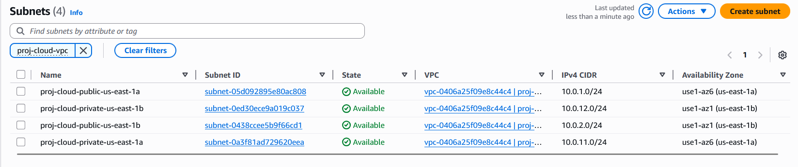
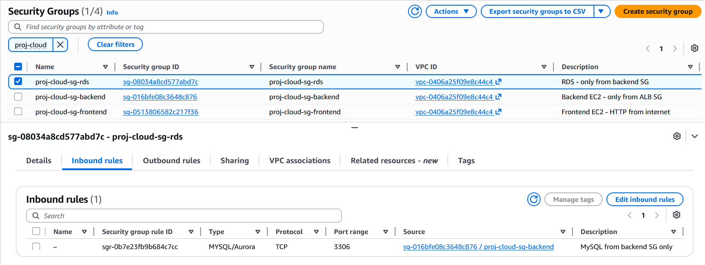
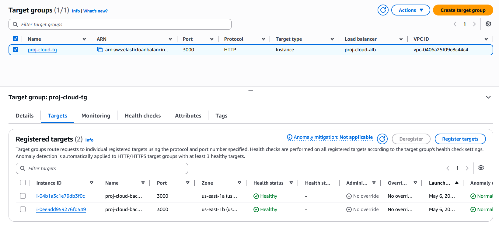
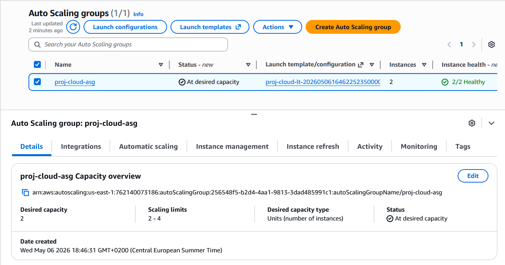
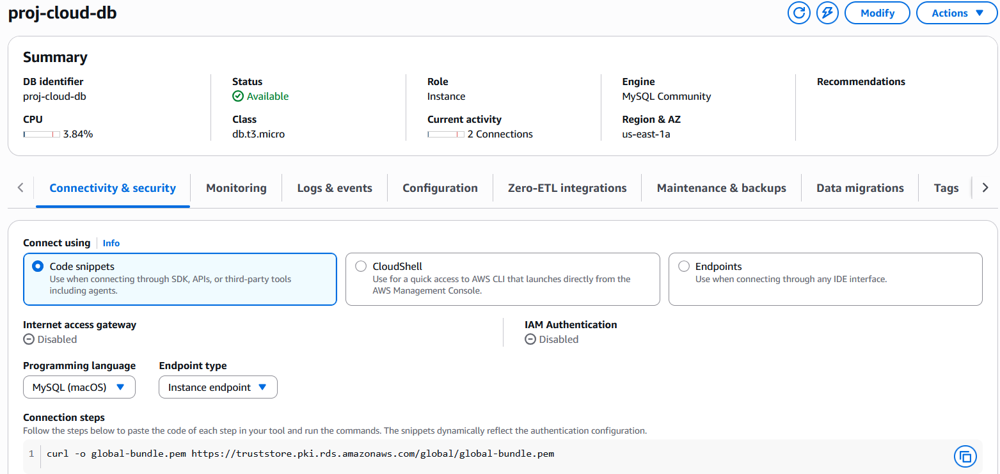
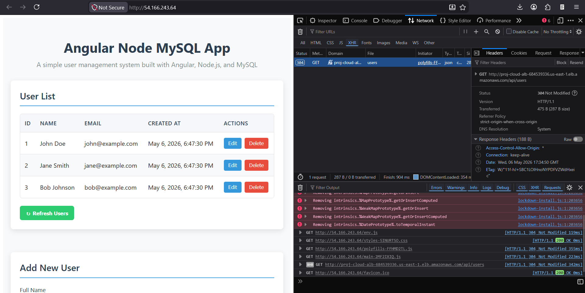

# Screenshots

| # | Capture | Preview |
|---|---------|---------|
| 1 | VPC resource map |  |
| 2 | 2 public + 2 private subnets across 2 AZs |  |
| 3 | The 4 Security Groups with their rules |  |
| 4 | ALB target group — healthy (2/2) |  |
| 5 | Auto Scaling Group — min 2 / desired 2 / max 4 |  |
| 6 | RDS Available, public access = No |  |
| 7 | Working Angular UI |  |
| 8 | DevTools — XHR going to the ALB DNS |  |
